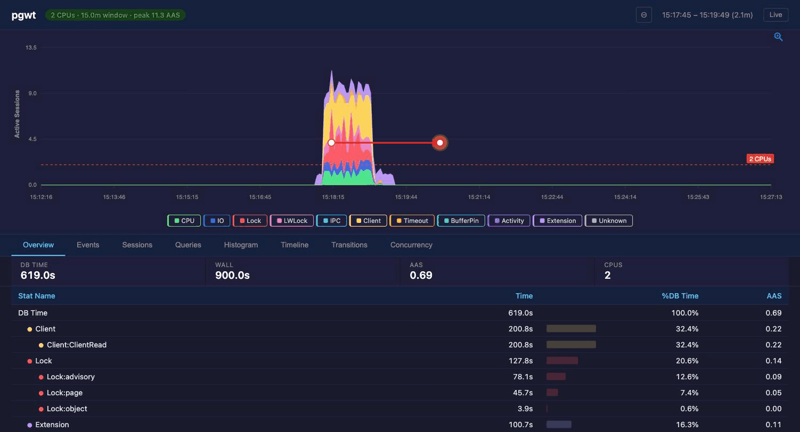

# pg_wait_tracer

Real-time, **tiered** PostgreSQL wait event tracer.

pg_wait_tracer attaches to a running PostgreSQL cluster and observes wait
events across all backends. It requires no PostgreSQL patches, no extensions,
and no restarts.

It runs in **two tiers** (default `--mode tiered`):

- An always-on, low-overhead **sampled** tier (ASH-style, pure userspace via
  `process_vm_readv` — ~0% impact on PostgreSQL) that you leave running 24/7.
- On-demand or anomaly-triggered **escalation** to the exact
  **hardware-watchpoint** tier, which captures every `wait_event_info`
  transition with nanosecond precision during bounded, budgeted windows.

This gives you Active Session History continuously, plus exact, every-transition
detail exactly when you need it — without paying the watchpoint overhead all the
time. The 10 Hz sampler agrees with the exact tier to within ~1 percentage point
(top-5 events match) on the same window, so tiered-by-default is trustworthy.

Key capabilities:

- **Tiered capture** (`--mode tiered`, default): always-on userspace sampler
  + on-demand/anomaly escalation to exact hardware-watchpoint tracing; also
  available as pure `--mode sampled` or always-on exact `--mode full`
- **Escalation**: bounded, budgeted full-fidelity windows, triggered manually
  (web UI "Escalate" button / control socket) or automatically by anomaly rules
  (AAS-vs-baseline and lock-class-fraction, with cooldown/hysteresis)
- **Control socket**: `{trace_dir}/pgwt.sock` JSON-line `status`/`metrics`/
  `escalate`/`deescalate`, proxied by `pgwt-server` for the web client, with
  Prometheus-ready self-observability metrics
- **7 diagnostic views**: time_model, system_event, session_event, histogram,
  query_event, active, transitions (Sankey diagram) — each tagged with its data
  fidelity (sampled / exact / mixed); exact-only views prompt to escalate over
  sampled-only windows instead of silently showing nothing
- **Web investigation client** (`pgwt`): browser UI with ECharts AAS chart,
  color-coded drill-down tables, percentage bars, summary metrics, concurrency
  peak overlay, burst detection markers — connects to DB server over SSH
- **Live mode**: auto-refreshing AAS chart with sliding time window, per-session
  event cache for immutable trace files
- **Text dump** (`pgwt-server --dump`): quick CLI summary of trace files
  (time model, top events, top sessions, top queries) — no TUI needed
- **Advanced analysis**: wait event transitions + fingerprinting, lock chain
  detection (waiter→blocker inference), cross-session interference scoring
- **Multi-window analysis**: compare wait profiles across time horizons
  (e.g. last 5s vs 1m vs 5m)
- **Daemon mode**: persistent monitoring with automatic re-attach on
  PostgreSQL restarts
- **Trace recording**: columnar LZ4-compressed event files with hourly
  rotation and configurable retention
- **Offline replay**: analyze historical trace files without root or a
  running PostgreSQL instance
- **Dynamic event names**: auto-discovers wait event names from PostgreSQL
  (PG17+) via `pg_wait_events`, forward-compatible with PG19+

In the default tiered mode the always-on sampler has **~0% impact on
PostgreSQL** (the daemon itself uses ~0.6% of one core at 10 Hz). The exact
watchpoint tier — used only during bounded escalation windows — costs ~6% on
write-heavy OLTP, up to ~30% on read-heavy workloads with high buffer miss
rates. See [Performance](#performance) for details.

> **Requirements — Linux only.** pg_wait_tracer relies on Linux-specific
> facilities (eBPF, `process_vm_readv`, `perf_event_open`, CPU hardware
> watchpoints) and cannot run on macOS, Windows, or \*BSD. Minimum environment:
>
> - **Linux kernel >= 5.8** with BTF enabled (`/sys/kernel/btf/vmlinux`
>   present), **or** EL8 (RHEL/Rocky/Alma/Oracle Linux 8.10, kernel 4.18 with
>   backported BTF + BPF ring buffer). EL9 (kernel 5.14) and Ubuntu are also
>   supported. The build auto-bundles a pinned libbpf/bpftool when the system
>   ones are too old (e.g. EL8's libbpf 0.5.0), so older distros build cleanly.
>   BTF is always required; on kernels without the BPF ring buffer the tool
>   degrades to sampled-only (the full tier needs ringbuf).
> - **Architecture**: x86_64 or aarch64
> - **Privileges**: root, or `CAP_BPF` + `CAP_PERFMON` + `CAP_SYS_PTRACE`
>   (older kernels: `CAP_SYS_ADMIN` + `CAP_SYS_PTRACE`)
> - **PostgreSQL**: 17 or 18 (full); 13 (supported — query attribution
>   requires `pg_stat_statements`); 14-16 not yet (see
>   [INSTALL.md](INSTALL.md))
>
> The web client (`pgwt`) and offline replay (`pg_wait_tracer --replay`,
> `pgwt-server --dump`) do not require root or Linux on the *client* side —
> only the DB server where tracing runs must meet the requirements above.

## Demo

Captured from a 60-second pgbench TPC-B workload (8 clients, scale 10) on a
tiny VM (2 vCPUs, Rocky 9 + PostgreSQL 18), with a few injected `LOCK TABLE`
statements to add lock contention. ~7M wait-event transitions captured. See
[`demos/README.md`](demos/README.md) for the recording tooling (one
`make all` reproduces both gifs from a fresh VM).

**Web investigation client** (`pgwt`) — drag-zoom AAS chart → drill into
Events / Sessions / Queries → wait-event transition graph:



**Text dump** (`pgwt-server --dump`) — time model + top events + top sessions
+ top queries from any trace file, no TUI required:


## Quick Start

```bash
# Build (see INSTALL.md for prerequisites)
make

# Run (auto-discovers single PG instance, must be root).
# Default capture tier is "tiered": a low-overhead always-on sampler that
# escalates to exact watchpoint tracing on demand (safe to leave running 24/7).
sudo ./pg_wait_tracer

# Force always-on exact watchpoint tracing (the original behavior, 6-30% overhead)
sudo ./pg_wait_tracer --mode full

# One-shot: collect one 10-second interval and exit
sudo ./pg_wait_tracer --mode full --count 1 --interval 10

# Multi-window: compare wait profiles across time horizons
sudo ./pg_wait_tracer --window 5s,1m,5m

# Daemon mode: persistent monitoring with trace recording
sudo ./pg_wait_tracer --daemon -T /var/lib/pgwt/traces

# Offline replay: analyze last hour from trace files (no root needed)
pg_wait_tracer --replay -T /var/lib/pgwt/traces --from 1h

# Web client: browser UI from your laptop over SSH (no root needed)
pgwt root@db-server

# Quick summary from trace files (no root needed)
pgwt-server --dump /var/lib/pgwt/traces
```

## Capture Tiers (`--mode`)

Orthogonal to the run modes below, `--mode` selects *how* wait events are
captured. The default is **`tiered`**.

| Mode | Fidelity | PG overhead | What it does |
|------|----------|-------------|--------------|
| `tiered` *(default)* | sampled, escalates to exact | ~0% baseline, bounded during escalation | Always-on userspace sampler (`process_vm_readv`); escalates to full watchpoint tracing for bounded, budgeted windows — on demand (control socket / web UI) or on anomaly. The "leave it running 24/7" posture. |
| `sampled` | sampled | ~0% on PostgreSQL | Pure-userspace ASH-style sampling at a fixed rate. No watchpoints, never escalates. |
| `full` | exact | 6-30% (workload-dependent) | Always-on hardware watchpoints — every `wait_event_info` transition captured exactly. The original behavior, now opt-in. |
| `coop` | exact | — | Cooperative (PostgreSQL extension) tier — **stub only**: the interface is frozen but the provider advertises itself and then returns "not available in this build". The real implementation ships in the separate PG-extension track. |

```bash
# Default — low-overhead always-on, escalate on demand
sudo ./pg_wait_tracer --daemon -T /var/lib/pgwt/traces

# Force exact watchpoint tracing for a focused investigation
sudo ./pg_wait_tracer --mode full --count 1

# Pure sampling at 50 Hz
sudo ./pg_wait_tracer --mode sampled --sample-rate 50
```

In `tiered` mode, EXACT-required views (histogram, transitions, fingerprints,
lock chains, interference, concurrency) report `requires full-fidelity data`
over windows with no escalation, rather than returning silently empty results
— the web client renders an explicit "escalate to capture" state.

### Escalation

A full-fidelity window can be opened two ways:

- **Manually** — the web UI's "Escalate" button, or the control socket
  (`{"cmd":"escalate","duration_s":N}`). `{"cmd":"deescalate"}` closes it early.
- **Automatically** — anomaly rules evaluated on the sampled stream:
  AAS exceeding a multiple of its rolling baseline (`--anomaly-aas-factor`,
  default 3.0× sustained `--anomaly-aas-ticks` ticks, default 3), or the
  Lock-class share of active samples exceeding `--anomaly-lock-fraction`
  (default 0.30). A cooldown (`--anomaly-cooldown-s`, default 120) prevents
  flapping.

Every window is bounded: per-window length is set by the request (or
`--anomaly-window-s`, default 60, for auto-triggers), and total escalation time
is capped by `--escalation-budget` (default 300s per rolling hour). When the
budget is exhausted, further escalations are denied (and counted in the
self-metrics).

```bash
# Open a 120s full-fidelity window on a running daemon via the control socket
echo '{"cmd":"escalate","duration_s":120}' | nc -U /var/lib/pgwt/traces/pgwt.sock

# Inspect current tier / budget
echo '{"cmd":"status"}'  | nc -U /var/lib/pgwt/traces/pgwt.sock
echo '{"cmd":"metrics"}' | nc -U /var/lib/pgwt/traces/pgwt.sock
```

## Control Socket

When recording is enabled (`--trace-dir`), the daemon listens on a unix-domain
socket at `{trace_dir}/pgwt.sock` (mode 0600). It speaks a newline-delimited
JSON protocol — one request object per line, one response object per line.
`pgwt-server` proxies it through to the web client as a single `control`
command, so the browser UI drives escalation and reads self-metrics without a
direct connection.

| Command | Request | Response (summary) |
|---------|---------|--------------------|
| `status` | `{"cmd":"status"}` | `mode`, `tier` (`sampled`/`escalated`), `escalation_supported`, `escalation_seconds_remaining`, `escalation_budget_remaining_s`, `escalation_reason`, `uptime_s`, `backends`, `pg_pid`, `version` |
| `metrics` | `{"cmd":"metrics"}` | self-observability counters (below) |
| `escalate` | `{"cmd":"escalate","duration_s":N}` | `escalated`, `granted_s`, `seconds_remaining`, `budget_remaining_s` — or `ok:false` + `error` + `budget_remaining_s` when over budget / not tiered |
| `deescalate` | `{"cmd":"deescalate"}` | closes the window now (idempotent); errors if not `--mode tiered` |

**Self-observability metrics** (`metrics` command — Prometheus-ready names):

- `events_total`, `events_per_sec`, `lifecycle_events_total`
- `samples_total`, `samples_per_sec`, `sample_read_faults_total`
- `wp_attach_failures_total`, `ringbuf_drops_total`, `backends_tracked`
- `trace_events_written_total`, `trace_bytes_written_total`
- `tier`, `escalation_active`, `escalation_seconds_remaining`,
  `escalation_budget_remaining_s`, `escalation_windows_total`,
  `escalation_denied_total`
- `anomaly_fires_total`, `anomaly_near_total`, `anomaly_dropped_budget_total`,
  `anomaly_dropped_cooldown_total`, `anomaly_baseline_aas`

## Operating Modes

pg_wait_tracer has three operating modes:

### Interactive (default)

Attaches to PostgreSQL, displays live views, and exits when interrupted or
when `--count`/`--duration` is reached. This is the original mode — useful
for quick investigations.

```bash
sudo ./pg_wait_tracer --view system_event --count 3
```

### Daemon (`--daemon`)

Runs persistently. When PostgreSQL restarts (crash, upgrade, `pg_ctl restart`),
the daemon detects the terminated postmaster, waits for a new one to appear,
and re-attaches automatically. BPF programs are destroyed and reloaded on each
cycle because BPF rodata is immutable after load.

Cannot be combined with `--count` or `--duration`.

```bash
# Daemon with trace recording and 48-hour retention
sudo ./pg_wait_tracer --daemon -T /var/lib/pgwt/traces -R 48

# Daemon with live output to terminal
sudo ./pg_wait_tracer --daemon --view active
```

**How restart detection works:**

1. Every interval tick, the daemon calls `kill(postmaster_pid, 0)` to check
   if the postmaster is alive.
2. When the postmaster dies, the daemon prints a message and enters a wait
   loop, checking for a new PostgreSQL instance every 5 seconds.
3. PGDATA is inferred from `/proc/<pid>/cwd` at startup (or provided via
   `--pgdata`). On restart, the daemon reads the new `postmaster.pid` from
   PGDATA to discover the new PID.
4. On re-attach, all BPF state is reset — accumulators start fresh.

### Replay (`--replay`)

Reads completed trace files and produces the same views as live mode, but
from historical data. Does not require root or a running PostgreSQL instance.

```bash
# Replay last hour, time_model view
pg_wait_tracer --replay -T /var/lib/pgwt/traces --from 1h

# Replay specific time range
pg_wait_tracer --replay -T /var/lib/pgwt/traces \
    --from "2025-02-25T14:00:00" --to "2025-02-25T14:30:00" \
    --view system_event

# Replay with multi-window
pg_wait_tracer --replay -T /var/lib/pgwt/traces --from 2h \
    --view query_event --window 5s,1m,5m
```

**Limitations:**

- The `active` view is not available in replay mode (it requires the live
  BPF state_map to read current wait states).
- `current.trace` (the file being written by the daemon) has no footer and
  cannot be read by replay. Only rotated `.trace.lz4` files are readable.
  Only rotated `.trace.lz4` files are readable by replay and `pgwt-server`.
- Output format is always `text` in replay mode.

### Web Investigation Client (`pgwt`)

A browser-based investigation tool that connects to a remote DB server over SSH.
No database credentials needed — it reads trace files directly on the server.

```bash
# From your laptop — opens browser automatically
pgwt root@db-server

# Custom trace directory and server binary path
pgwt --trace-dir /var/lib/pgwt/traces \
     --server-path /usr/local/bin/pgwt-server \
     root@db-server
```

**Architecture:**

```
[Your laptop]                        [DB server]
pgwt (Go binary)                     pgwt-server (C binary)
  ├─ spawns: ssh user@host             ├─ reads trace files
  │    pgwt-server <trace-dir>         ├─ computes aggregates
  ├─ localhost:8384 HTTP server        └─ JSON lines on stdin/stdout
  └─ browser UI (ECharts)
```

**Features:**

- **AAS stacked area chart** (ECharts) — 11 wait class colors, interactive
  zoom with drag-to-select, tooltip with per-class AAS breakdown and percentages.
  **Fidelity shading**: sampled-only spans are washed amber and mixed spans
  indigo, so you can see at a glance which parts of the window are estimated vs
  exact; escalation windows are annotated (cyan for manual, red for anomaly).
- **Escalate control** — an "Escalate" button in the header opens a
  full-fidelity window (and shows the seconds left / a "Stop" button while one
  is open), plus a budget readout of full-fidelity seconds remaining this hour.
- **Daemon self-metrics panel** — live tier, events/s, samples/s, ringbuf
  drops, sample faults, estimated overhead, anomaly counters, baseline AAS, and
  remaining escalation budget (read over the control socket).
- **4 table views**: Overview (time model), Events, Sessions, Queries
- **Drill-down navigation**: click a wait class → see its events → click an
  event → see sessions → click a session → see queries. Breadcrumb trail
  with colored dots shows filter stack with click-to-go-back.
- **Color-coded dots**: wait class colors shown next to event/class names
  in all 4 tables
- **Percentage bars**: visual bar fills behind `%DB`, `CPU%`, `Wait%` columns,
  colored by wait class
- **Summary metrics**: DB Time, Wall clock, AAS, Idle time, CPUs shown
  above the overview table
- **Sortable columns**: click any column header to sort ascending/descending
- **Auto-reconnect**: WebSocket reconnects with exponential backoff on
  connection loss
- **Zero config**: auto-discovers trace files, auto-opens browser

**Prerequisites on DB server:** `pgwt-server` binary and trace files from the
daemon. See [INSTALL.md](INSTALL.md) for build instructions.

**Flags:**

| Flag | Default | Description |
|------|---------|-------------|
| `--port` | 8384 | Local HTTP port |
| `--trace-dir` | `/var/lib/pgsql/18/data/pg_wait_tracer/` | Trace directory on the remote host |
| `--server-path` | `pgwt-server` | Path to `pgwt-server` binary on the remote host |

### Text Dump (`pgwt-server --dump`)

Quick CLI summary of trace files — time model, top events, top sessions, top
queries. No TUI, no browser, no root. Useful for SSH one-liners.

```bash
# Summary of all trace files
pgwt-server --dump /var/lib/pgwt/traces

# Pipe-friendly (combine with standard tools)
pgwt-server --dump /var/lib/pgwt/traces | grep "IO:"
```

See [INSTALL.md](INSTALL.md) for build instructions and
[docs/ROADMAP.md](docs/ROADMAP.md) for the development roadmap.

**Planned features** (see roadmap for details):
- Query text capture from `st_activity` in shared memory
- Plan identifier capture (`st_plan_id`, PG18+) for plan regression detection
- Live mode (connect web client to running daemon for real-time streaming)

## CLI Reference

### Target Selection

| Flag | Short | Default | Description |
|------|-------|---------|-------------|
| `--pid <PID>` | `-p` | auto-detect | Postmaster PID |
| `--pgdata <DIR>` | `-D` | auto-detect | PGDATA directory (reads postmaster.pid) |

**Auto-discovery:** When neither `--pid` nor `--pgdata` is given, pg_wait_tracer
scans `/proc` for running PostgreSQL instances. If exactly one is found, it
attaches automatically. If multiple are found, it lists them and exits.

### Output Control

| Flag | Short | Default | Description |
|------|-------|---------|-------------|
| `--view <VIEW>` | `-V` | `time_model` | Output view (see Views section) |
| `--sort <MODE>` | `-S` | `wait_time` | Sort for active view: `wait_time`, `db_time`, `pid`, `event` |
| `--format <FMT>` | `-f` | auto-detect | Output format: `tui` (terminal), `text` (pipe) |
| `--interval <SEC>` | `-i` | 5 | Refresh interval in seconds (minimum 1) |
| `--duration <SEC>` | `-d` | unlimited | Stop after N seconds |
| `--count <N>` | `-n` | unlimited | Print N intervals then exit |
| `--window <W1,W2,W3>` | `-w` | — | Time windows, e.g. `5s,1m,5m` (first must equal interval) |

**Format auto-detect:** When stdout is a terminal, output uses TUI mode (screen
clearing). When piped or redirected, output switches to text mode (timestamps
per interval, no screen clearing).

### Filters

| Flag | Short | Default | Description |
|------|-------|---------|-------------|
| `--event <NAME>` | `-e` | — | Event filter (required for histogram; optional for query_event) |
| `--pid-filter <PID>` | `-P` | — | Per-event detail for one backend (session_event view) |
| `--query-id <ID>` | `-Q` | — | Filter query_event to one query |

### Trace Recording

| Flag | Short | Default | Description |
|------|-------|---------|-------------|
| `--trace-dir <DIR>` | `-T` | disabled | Directory for trace files (enables recording) |
| `--trace-retention <H>` | `-R` | 24 | Keep trace files for H hours |
| `--trace-group <GROUP>` | — | `dba` | Unix group for trace file access |

### Replay

| Flag | Short | Default | Description |
|------|-------|---------|-------------|
| `--replay` | — | off | Replay mode (read trace files instead of live tracing) |
| `--from <TIME>` | — | start of files | Start time for replay |
| `--to <TIME>` | — | end of files | End time for replay |

**Time formats for `--from`/`--to`:**

- ISO 8601: `2025-02-25T14:30:00` or `2025-02-25 14:30:00`
- Relative: `1h`, `30m`, `90s`, `2h30m` (that much time ago from now)
- Special: `now`

### Daemon

| Flag | Short | Default | Description |
|------|-------|---------|-------------|
| `--daemon` | — | off | Persistent mode with PostgreSQL restart detection |

### Capture Tier

| Flag | Short | Default | Description |
|------|-------|---------|-------------|
| `--mode <MODE>` | — | `tiered` | Capture tier: `tiered` (always-on sampler + on-demand escalation), `sampled`, `full` (exact watchpoints), `coop` (stub). See [Capture Tiers](#capture-tiers---mode) |
| `--sample-rate <HZ>` | — | `10` | Sampling rate for `sampled`/`tiered` (1-1000 Hz) |
| `--escalation-budget <S>` | — | `300` | `tiered`: full-fidelity seconds allowed per rolling hour (0 disables the limit) |

### Anomaly Triggers (tiered mode)

Auto-escalation rules evaluated on the sampled stream. Ignored outside
`--mode tiered`.

| Flag | Short | Default | Description |
|------|-------|---------|-------------|
| `--anomaly-aas-factor <K>` | — | `3.0` | Fire when AAS > K × rolling baseline |
| `--anomaly-aas-ticks <N>` | — | `3` | ...sustained for N consecutive ticks |
| `--anomaly-lock-fraction <F>` | — | `0.30` | Fire when Lock-class share of active samples > F (sustained N ticks) |
| `--anomaly-cooldown-s <S>` | — | `120` | Minimum seconds between auto-escalations |
| `--anomaly-window-s <S>` | — | `60` | Full-fidelity window length per auto-trigger |

### Performance Tuning

| Flag | Short | Default | Description |
|------|-------|---------|-------------|
| `--lightweight` | — | off | BPF accumulator only (no ringbuf). ~5.5% overhead, loses histogram/session/query views |
| `--skip-query-id` | — | off | Skip query_id reads in BPF. Saves ~1.5% overhead, disables query_event view |

### Other

| Flag | Short | Default | Description |
|------|-------|---------|-------------|
| `--verbose` | `-v` | off | Print diagnostic info to stderr |
| `--help` | `-h` | — | Show usage |

## Views

### time_model (default)

System-wide time accounting with event hierarchy. Shows how backends spend their
time, broken down by CPU and each wait class, with the top individual events
shown as indented subcategories under each class. This is the starting point
for any investigation.

**Columns:**

| Column | Description |
|--------|-------------|
| Stat Name | Time category (class or individual event) |
| Time (ms) | Duration in the interval |
| % DB Time | Fraction of total DB Time |

**Event hierarchy:** Each wait class shows the top 3 individual events that
contribute >= 1% of DB Time, indented beneath the class total. CPU has no
sub-events (it is not a wait class). Classes with 0 time are hidden.

**Example:**

```
════════════════════════════════════════════════════════════════════════════════
pg_wait_tracer — Time Model    Backends: 12    Interval: 5s
════════════════════════════════════════════════════════════════════════════════

  Stat Name                           Time (ms) % DB Time
  ────────────────────────────────────────────────────────────────────────────
  DB Time                            25088.6     100.0%
    CPU*                              5498.6      21.9%
    IO                                3262.8      13.0%
      IO:DataFileRead                 2534.1      10.1%
      IO:DataFileWrite                 312.4       1.2%
    Lock                              2104.3       8.4%
      Lock:Transaction                1980.1       7.9%
    LWLock                            1823.2       7.3%
      LWLock:WALInsert                1312.3       5.2%
      LWLock:BufferContent             410.8       1.6%
    Timeout                            450.0       1.8%

  (Activity/Idle — excluded from DB Time)    13442.5       —
```

`Client:ClientRead` (a backend waiting for the next query from the client) is
treated as **idle** — like Oracle's "SQL\*Net message from client" — so it is
excluded from DB Time. It still shows up in event lists, but with `—` in the
`% DB` column; only the Activity class is hidden entirely.

**Reading this output:**

- **DB Time** is the total non-idle time across all backends. With 12 backends
  over a 5-second interval, the maximum is 60,000 ms (12 x 5000).
- **CPU\*** means time when no PostgreSQL wait event was set. This is mostly
  CPU execution, but may include uninstrumented code paths. The asterisk
  indicates it is an approximation.
- **IO at 13.0%** — and you can immediately see that **DataFileRead at 10.1%**
  is the dominant IO event. No need to switch to `system_event` view.
- **Lock at 8.4%** — the sub-event shows it's almost entirely Transaction
  locks (7.9%), meaning queries are blocked by other uncommitted transactions.
- Small events below 1% of DB Time are hidden to avoid clutter. Use
  `system_event` view for the full event list.
- **Activity/Idle** is shown separately and excluded from DB Time. Idle backends
  contribute nothing to DB Time.

#### Multi-window mode

With `--window`, the time_model view shows side-by-side columns — one per window —
so you can see how wait profiles change across time horizons:

```bash
sudo ./pg_wait_tracer --window 5s,1m,5m
```

```
════════════════════════════════════════════════════════════════════════════════
pg_wait_tracer — Time Model    Backends: 12    Interval: 5s
════════════════════════════════════════════════════════════════════════════════

  Stat Name                         Last 5s    % DB   Last 1m    % DB   Last 5m    % DB
  -------------------------------- --------- ------- --------- ------- --------- -------
  DB Time                            5088.6  100.0%   62340.1  100.0%  312450.8  100.0%
    CPU*                             1498.6   29.4%   13712.3   22.0%   72312.1   23.1%
    IO                                862.3   16.9%   12340.5   19.8%   98234.2   31.4%
      IO:DataFileRead                 621.2   12.2%    9823.1   15.8%   82123.4   26.3%
      IO:DataFileWrite                198.4    3.9%    2012.3    3.2%   12345.6    4.0%
    LWLock                            423.1    8.3%    4923.4    7.9%   21234.5    6.8%
      LWLock:WALInsert                312.3    6.1%    3812.1    6.1%   16234.2    5.2%

  (Activity/Idle)                   12560.4       -   62340.1       -  312450.8       -
```

**Reading this output:**

- Each column shows the delta for that time window. "Last 5s" is the most recent
  5 seconds, "Last 5m" covers the last 5 minutes.
- Compare columns to spot trends: IO rising from 16.9% (5s) to 31.4% (5m) means
  IO has been decreasing recently — the system is improving.
- **Progressive population:** On startup, shorter windows fill first. Longer windows
  show `-` until enough history accumulates (e.g., "Last 5m" needs 5 minutes of data).
- The first window must equal the `--interval` value. Windows must be increasing.
- Without `--window`, the default single-column cumulative view is shown (see above).

---

### system_event

Top wait events across all backends, ranked by total duration. Use this to
identify which specific events consume the most time.

**Columns:**

| Column | Description |
|--------|-------------|
| Wait Event | Event name as `Class:Event` (e.g. `IO:DataFileRead`) or `CPU*` |
| Total Waits | Number of occurrences |
| Total (ms) | Cumulative duration |
| Avg (us) | Average duration per occurrence |
| Max (us) | Longest single occurrence |
| % DB | Fraction of DB Time |

**Example:**

```
════════════════════════════════════════════════════════════════════════════════
pg_wait_tracer — System Events (cumulative)    Backends: 12
════════════════════════════════════════════════════════════════════════════════

  Wait Event                 Total Waits     Total (ms)   Avg (us)     Max (us)    % DB
  ────────────────────────────────────────────────────────────────────────────────────────
  CPU*                          43460        5498.6      126.5     10630.2   21.9%
  IO:DataFileRead                8234        3262.8      396.2     45623.1   13.0%
  Lock:Transaction                567        2104.3     3712.2    892100.5    8.4%
  LWLock:WALInsert               4812        1823.2      378.9      8934.2    7.3%
  Client:ClientRead              1203         882.1      733.1     25410.3      —
  Timeout:PgSleep                   3         450.0   150000.0    200012.1    1.8%
  IO:DataFileWrite               1056         312.4      295.8      5612.0    1.2%
  LWLock:BufferContent            892         198.7      222.8      3451.0    0.8%
```

**Reading this output:**

- Events are sorted by `Total (ms)`, so the top rows are the biggest bottlenecks.
- **High Avg with low count** (like `Lock:Transaction`) means long individual waits
  — a few queries are blocking.
- **Low Avg with high count** (like `LWLock:WALInsert`) means frequent short waits
  — high concurrency on the WAL.
- **Large Max vs Avg gap** suggests outlier events. Use `histogram` view to see
  the full distribution.

#### Multi-window mode

With `--window`, the system_event view shows vertically stacked sections — one per
window — so you can see how the top events change across time horizons:

```bash
sudo ./pg_wait_tracer --view system_event --window 5s,1m,5m
```

```
════════════════════════════════════════════════════════════════════════════════
pg_wait_tracer — System Events    Backends: 12    Interval: 5s
════════════════════════════════════════════════════════════════════════════════

---- Last 5s -----------------------------------------------------------------
  Wait Event                  Total Waits     Total (ms)   Avg (us)      % DB
  -------------------------- ------------ -------------- ---------- ---------
  CPU*                           4346        549.9      126.5     21.9%
  IO:DataFileRead                 823        326.3      396.2     13.0%
  Lock:transactionid               57        210.4     3712.2      8.4%
  ...

---- Last 1m -----------------------------------------------------------------
  Wait Event                  Total Waits     Total (ms)   Avg (us)      % DB
  -------------------------- ------------ -------------- ---------- ---------
  CPU*                          52143       6598.7      126.5     22.0%
  IO:DataFileRead                9882       3915.4      396.2     13.0%
  ...

---- Last 5m -----------------------------------------------------------------
  (waiting for data)
```

**Reading this output:**

- Each section shows the delta for that time window. Events are sorted by total
  duration within each section, so the ranking can differ between windows.
- **Max (us) is not shown** in multi-window mode because delta snapshots track
  cumulative count and total — not per-window maximums. Avg (us) is still valid.
- Shorter windows fill first. Longer windows show "(waiting for data)" until enough
  history accumulates.
- Without `--window`, the default single-column cumulative view is shown (see above),
  which includes the Max (us) column.

---

### session_event

Per-backend summary. Shows each backend's DB Time, CPU/Wait ratio, and top
wait event. Use `--pid-filter` to drill into a specific backend.

**Columns (summary):**

| Column | Description |
|--------|-------------|
| PID | Backend process ID |
| Type | Backend type (client, bgwriter, checkpointer, walwriter, etc.) |
| User | Connected user (or `-`) |
| DB | Database (or `-`) |
| DB Time(ms) | Non-idle time for this backend |
| CPU% | Time spent on CPU |
| Wait% | Time spent waiting |
| Top Wait | Highest-duration wait event |

**Example:**

```
════════════════════════════════════════════════════════════════════════════════
pg_wait_tracer — Session Summary    Backends: 12
════════════════════════════════════════════════════════════════════════════════

  PID     Type           User       DB         DB Time(ms)  CPU% Wait%  Top Wait
  ──────────────────────────────────────────────────────────────────────────────────
  12345   client         app        mydb          4096.2  42.1% 57.9%  IO:DataFileRead
  12346   client         app        mydb          3820.5  38.4% 61.6%  Lock:Transaction
  12347   client         admin      mydb          1024.0  71.2% 28.8%  LWLock:WALInsert
  12400   bgwriter       -          -              512.3  62.1% 37.9%  IO:DataFileWrite
  12401   checkpointer   -          -              256.1  15.3% 84.7%  IO:DataFileSync
  12402   walwriter      -          -              128.0  44.2% 55.8%  IO:WALWrite
```

**With `--pid-filter 12345`**, an additional detail table appears below the
summary, showing the full event breakdown for that backend (same columns as
system_event).

**Reading this output:**

- **CPU% + Wait% = 100%** for each backend's active time.
- A backend with high Wait% and `Lock:Transaction` as top wait is blocked by
  another transaction — check for long-running queries or deadlocks.
- System processes (bgwriter, checkpointer, walwriter) normally show IO waits.

---

### active

A "top-like" view of currently active backends, showing each backend's current
state, wait event, and cumulative DB Time. This is the first view a DBA opens to
see what's happening right now.

```bash
sudo ./pg_wait_tracer --view active
sudo ./pg_wait_tracer --view active --sort db_time
```

**Columns:**

| Column | Description |
|--------|-------------|
| PID | Backend OS process ID |
| State | `on cpu`, `waiting`, or `idle` (from BPF tracing state) |
| Wait Event | Current wait event name (if waiting), `—` otherwise |
| Wait (ms) | Duration in current wait state, `—` if not waiting |
| DB Time (ms) | Cumulative non-idle time for this backend |
| Backend Type | From `/proc/PID/cmdline` parsing |

**Example:**

```
════════════════════════════════════════════════════════════════════════════════
pg_wait_tracer — Active Sessions    Backends: 12    Uptime: 32m 15s
════════════════════════════════════════════════════════════════════════════════

  PID     State      Wait Event                  Wait (ms)   DB Time (ms)  Backend Type
  ------- ---------- ------------------------ ------------ -------------- ------------------
  34521   waiting    Lock:Transaction             8923.1        12450.3  client
  34587   waiting    IO:DataFileRead                 3.2         8234.1  client
  34602   on cpu     —                               —          5123.4  client
  34534   waiting    LWLock:WALInsert                0.8         4892.1  client
  34498   waiting    Client:ClientRead            1234.5         3421.2  client
  34612   idle       —                               —              —  client
  34701   idle       —                               —              —  autovac_launcher
  34702   idle       —                               —              —  walwriter
```

**Sorting** (`--sort` flag):

| Mode | Description |
|------|-------------|
| `wait_time` | Sort by current wait duration, longest first (default) |
| `db_time` | Sort by cumulative DB Time, highest first |
| `pid` | Sort by PID ascending |
| `event` | Sort by wait event name alphabetically |

**Reading this output:**

- **waiting** means the backend is blocked on a wait event. The Wait (ms) column
  shows how long it has been stuck. A backend waiting on `Lock:Transaction` for
  8923 ms is blocked by another transaction.
- **on cpu** means no PostgreSQL wait event is set — the backend is executing.
- **idle** means the backend is in an Activity wait (waiting for a new query).
  Idle backends contribute no DB Time.
- The active view requires live BPF — it is not available in replay mode.

---

### histogram

Latency distribution for a single event, using 16 log2 buckets from <1 us
to >=16 ms. Requires the `--event` flag.

**Columns:**

| Column | Description |
|--------|-------------|
| Bucket(us) | Duration range in microseconds |
| Waits | Count of occurrences in this bucket |
| % Waits | Percentage of total occurrences |
| Cumulative | Running cumulative percentage |
| (bar) | ASCII visualization (each `#` ~ 2%) |

**Example:**

```bash
sudo ./pg_wait_tracer --view histogram --event IO:DataFileRead
```

```
════════════════════════════════════════════════════════════════════════════════
pg_wait_tracer — Event Histogram
════════════════════════════════════════════════════════════════════════════════

  Event: IO:DataFileRead | Total Waits: 8234 | Total: 3262.8 ms

  Bucket(us)        Waits    % Waits   Cumulative
  ────────────────────────────────────────────────────────────────────────────
       <1            123      1.5%        1.5%  #
    1-  2            456      5.5%        7.0%  ###
    2-  4           1832     22.3%       29.3%  ###########
    4-  8           2105     25.6%       54.8%  #############
    8- 16           1543     18.7%       73.6%  #########
   16- 32            987     12.0%       85.5%  ######
   32- 64            534      6.5%       92.0%  ###
   64-128            312      3.8%       95.8%  ##
  128-256            178      2.2%       98.0%  #
  256-512             89      1.1%       99.0%
  512-1K              42      0.5%       99.5%
   1K- 2K             18      0.2%       99.7%
   2K- 4K              8      0.1%       99.8%
   4K- 8K              4      0.0%       99.9%
   8K-16K              2      0.0%       99.9%
  >=16K                1      0.0%      100.0%
```

**Reading this output:**

- A **tight peak** in low buckets (2-16 us) means reads are hitting the OS page
  cache — fast.
- A **bimodal distribution** with peaks at both low and high buckets means some
  reads hit cache while others go to disk.
- A **heavy tail** (significant counts in 1K+ us buckets) indicates storage
  latency spikes — check disk I/O saturation.

Multi-window mode shows side-by-side columns per window, without the ASCII bar
and cumulative columns.

---

### query_event

Wait events grouped by PostgreSQL query ID. Shows which queries cause which
waits. Requires `compute_query_id = on` (or `auto`) in `postgresql.conf`.

> **PG13:** there is no in-core query_id, so query attribution requires
> **`pg_stat_statements`** in `shared_preload_libraries` (its hook populates the
> query id pg_wait_tracer reads). Without it, query views report unavailable —
> wait capture itself is unaffected. PG17/18 use the native query_id directly.

Three modes are available depending on flags:

#### Mode A (default) — Top query-event combinations

Shows all query/event pairs sorted by total duration. This is the starting point
for identifying which queries contribute most to wait time.

```
  query_id             Wait Event                 Total Waits     Total (ms)   Avg (us)     Max (us)    % DB
  ─────────────────────────────────────────────────────────────────────────────────────────────────────────────
   5678234567890123     IO:DataFileRead                2340        1024.5      437.8     45623.1    4.1%
   1234567890123456     Lock:Transaction                145         892.3     6153.8    892100.5    3.6%
```

Cross-reference `query_id` with `pg_stat_statements`:
```sql
SELECT query FROM pg_stat_statements WHERE queryid = 5678234567890123;
```

#### Mode B (`--event`) — Top queries for a specific event

Answers: "Which queries are responsible for this wait event?"

```bash
sudo ./pg_wait_tracer --view query_event --event IO:DataFileRead
```

#### Mode C (`--query-id`) — Wait profile for one query

Answers: "What does this query spend its time waiting on?"

```bash
sudo ./pg_wait_tracer --view query_event --query-id 5678234567890123
```

All three modes support `--window` with vertically stacked sections per window.

## Advanced Analysis (Web Client)

The web client (`pgwt`) provides additional analysis views beyond the CLI.
These all need exact transition data (old→new ordering, real overlap
intervals), so they are **full-fidelity only**: over a sampled-only window they
show a "requires full-fidelity data — escalate to capture" state rather than an
empty or misleading result.

### Transitions (Sankey Diagram)

Visualizes wait event state transitions as a Sankey flow diagram. Shows which
events commonly follow each other (e.g., CPU → IO:DataFileRead → CPU).

The server also computes per-query **fingerprints** — compact signatures like
`IO:30%|CPU:22%|LWLock:21%|Lock:13%` that characterize each query's wait profile.
Useful for detecting query plan changes (same query_id, different fingerprint).

### Concurrency Peaks + Burst Detection

Overlaid on the AAS chart as a dashed "Peak Concurrency" line showing the maximum
number of sessions simultaneously in the same wait state per time bucket.

**Burst markers** (red triangles) highlight moments when 4+ sessions entered the
same wait event within 10ms — "thundering herd" detection.

### Lock Chains

Infers waiter→blocker relationships from trace data. For each Lock-class wait,
identifies which other PID was most likely holding the lock (on CPU during the
same time interval). Available via `lock_chains` server endpoint.

### Interference Scoring

Scores PID pairs by how much time they spend waiting on the same event
simultaneously. High-scoring pairs are "noisy neighbors" contending on the
same resources. Available via `interference` server endpoint.

## Trace File Format

When `--trace-dir` is specified, the daemon (or interactive mode) writes raw
events to disk in a columnar, LZ4-compressed format.

### File layout

```
[File Header - 28 bytes]
  magic: "PGWT"
  version: 1
  flags: 0x0001 (LZ4)
  pg_version: major version (17, 18, ...)
  start_time_ns: wall-clock (CLOCK_REALTIME)
  clock_offset_ns: monotonic (CLOCK_MONOTONIC)

[Block 0]
  [Block Header - 28 bytes]
    first/last timestamp, num_events, compressed/uncompressed size
  [LZ4 Compressed Columnar Data]
    Columns: timestamp (delta + varint), pid, old_event, new_event,
             duration (varint), query_id

[Block 1]
  ...

[Footer]
  [Block Index - N x 16 bytes]
    (first_timestamp, file_offset) per block
  [Block Count - 4 bytes]
```

### File lifecycle

- **Active file**: `current.trace` — being written, no footer. Not readable
  by the C replay mode. Only rotated `.trace.lz4` files are readable.
- **Rotation**: Every calendar hour, the current file is finalized (footer
  written) and renamed to `YYYY-MM-DD_HH.trace.lz4`.
- **Retention**: Files older than `--trace-retention` hours are deleted.
  Cleanup runs every 60 ticks (60 x interval seconds).
- **Block size**: 4096 events per block. Blocks are flushed when full or
  on rotation.
- **Compression ratio**: Typical ~36x (36 bytes/event raw, ~1 byte compressed).

## Wait Event Classes

| Class | Description | Included in DB Time |
|-------|-------------|:---:|
| **CPU\*** | No wait event set (mostly CPU execution, see note below) | Yes |
| **IO** | Storage I/O: reads, writes, syncs, extends | Yes |
| **LWLock** | Lightweight locks: WAL, buffers, proc array, etc. | Yes |
| **Lock** | Heavy locks: row, table, transaction, advisory | Yes |
| **BufferPin** | Waiting to pin a shared buffer | Yes |
| **Client** | Waiting for client: reading query, sending results | Partial† |
| **IPC** | Inter-process communication: parallel workers, replication | Yes |
| **Timeout** | Timed waits: `pg_sleep()`, statement timeouts | Yes |
| **Extension** | Extension-generated events (e.g. pg_wait_sampling) | Yes |
| **Activity** | Idle states: waiting for next query | **No** (hidden) |

† **Client is included except `Client:ClientRead`**, which is treated as idle
(a backend waiting for the next query — Oracle's "SQL\*Net message from client")
and excluded from DB Time / AAS. Unlike the Activity class, `Client:ClientRead`
stays **visible** in event lists and graphs — only its `% DB` shows `—`. Only
the Activity class is hidden entirely.

## Understanding DB Time

**DB Time** is the total non-idle wall-clock time across all backends:

```
DB Time = CPU*
        + IO
        + LWLock
        + Lock
        + BufferPin
        + Client (except Client:ClientRead)
        + IPC
        + Timeout
        + Extension
```

Idle events are explicitly excluded: the entire **Activity** class and
**`Client:ClientRead`** (a backend waiting for the next query). A backend
sitting idle between queries does not contribute to DB Time.

With N backends over an interval of T seconds, the theoretical maximum DB Time
is `N x T x 1000` ms. For example, 12 backends over 5 seconds = 60,000 ms max.
If DB Time is much lower than this maximum, most backends are idle.

**CPU\*** is the time when `wait_event_info = 0` (NULL) in PostgreSQL — no wait
event was set. This is mostly CPU execution time, but may also include code
paths that PostgreSQL does not instrument with wait events. The asterisk is
a reminder that this is not a precise CPU measurement.

```
CPU% = CPU* / DB Time x 100
```

A healthy OLTP workload typically shows CPU% between 30-70%. Below 30% means
the system is wait-bound. Above 80% on a saturated system means CPU is the
bottleneck.

## Interpreting Results

### High IO%

Storage is the bottleneck. Check which IO events dominate:

- **DataFileRead** — Sequential or index scans reading from disk. Consider
  adding indexes, increasing `shared_buffers`, or using faster storage.
- **DataFileWrite** — Dirty page writes. May indicate checkpoint pressure
  (`checkpoint_completion_target`, `max_wal_size`).
- **DataFileSync** — fsync calls. Check `wal_sync_method` and storage write
  cache settings.
- **WALWrite/WALSync** — WAL is the bottleneck. Consider faster WAL storage
  or tuning `wal_buffers`.

> **PG18 asynchronous I/O caveat.** Under PG18's default `io_method=worker`, a
> single logical read is split across processes: the requesting backend shows
> `IO:AioIoCompletion` (or no wait at all if the read completed in the
> background), while the actual `IO:DataFileRead` happens on an **io_worker**
> that carries no requesting-query context. As a result, **per-query I/O
> attribution is partial** under `worker` — the read latency is captured, but
> it cannot always be tied back to the originating query. This is a known
> limitation; system-wide IO totals remain correct.

### High Lock%

Transaction-level contention. Common causes:

- **Lock:Transaction** — Waiting for another transaction to commit/rollback.
  Look for long-running transactions holding row locks.
- **Lock:Relation** — Table-level lock conflicts (DDL vs DML).
- **Lock:Tuple** — Row-level lock contention. Multiple sessions updating the
  same rows.

### High LWLock%

Internal PostgreSQL contention:

- **WALInsert** — Many concurrent sessions writing WAL. Normal under heavy
  write load. Consider `wal_buffers` tuning.
- **BufferContent** — Contention on shared buffer pages. May indicate hot pages.
- **LockManager** — Lock table contention under very high concurrency.

### High Client%

The application is slow to consume results or send queries:

- **ClientRead** — Backend is waiting for the client to send the next query.
  If this is high during active workload, check network latency or connection
  pooler configuration.
- **ClientWrite** — Backend is waiting for the client to accept result data.
  The client may be processing results too slowly.

### High IPC%

Inter-process communication waits, typically from parallel query:

- **ParallelWorkerSync/ParallelQueryDSM** — Parallel workers synchronizing.
  Normal during parallel queries. If excessive, consider tuning
  `max_parallel_workers_per_gather`.

### Using Histogram

The histogram view reveals latency distribution patterns:

- **Unimodal peak at low values** (2-16 us for IO) — reads from OS page cache, healthy.
- **Bimodal** (peaks at both low and high buckets) — mix of cache hits and disk reads.
  The ratio shows effective cache hit rate.
- **Heavy right tail** (many events in ms+ buckets) — storage latency problems,
  possible I/O saturation.
- **Uniform spread** — unpredictable latency, possible noisy-neighbor or swap.

### Using query_event

Workflow for finding problematic queries:

1. Start with **Mode A** (default) to identify the top query/event combinations:
   ```bash
   sudo ./pg_wait_tracer --view query_event
   ```
2. Look up the SQL in pg_stat_statements:
   ```sql
   SELECT queryid, calls, mean_exec_time, query
   FROM pg_stat_statements
   ORDER BY total_exec_time DESC;
   ```
3. Drill down with **Mode B** to see which queries are responsible for a specific
   bottleneck event:
   ```bash
   sudo ./pg_wait_tracer --view query_event --event IO:DataFileRead
   ```
4. Or use **Mode C** to get the full wait profile of a specific query:
   ```bash
   sudo ./pg_wait_tracer --view query_event --query-id 5678234567890123
   ```
5. Correlate: a query with high `IO:DataFileRead` time may need better indexes;
   a query with high `Lock:Transaction` time is hitting contention.

## Testing

The test suite has 5 layers. Running the full suite requires root access and a
running PostgreSQL instance. Individual layers can be run independently.

### Quick start

```bash
# Run everything (root + running PG required for integration tests)
sudo tests/run_all.sh

# Auto-detect a specific PG version when multiple are installed
sudo tests/run_all.sh --pg-version 18
```

### Test layers

| Layer | Tests | Requires | What it proves |
|-------|-------|----------|----------------|
| **C unit tests** | `test_wait_event`, `test_cmdline`, `test_bucket` | `make -C tests` | Event ID parsing, CLI parser, histogram buckets |
| **Synthetic data** | `test_data_*.py` (11 suites) | `pgwt-server` + `gen_test_traces` | Compute math: time model, events, sessions, queries, filters, idle, edge cases, transitions, fingerprints, lock chains, interference (91 checks, 0% tolerance) |
| **CLI integration** | `test_cli.sh`, `test_lifecycle.sh` | Root + PG | CLI flags, daemon lifecycle |
| **Live correctness** | `test_accuracy.py`, `test_percentage.py`, `test_aas_accuracy.py`, etc. (14 suites) | Root + PG + pgbench | BPF → file → compute pipeline against real workloads |
| **Web UI** | `test_web_ui.py` | Python + playwright + websockets | 108 checks: tabs, tables, sorting, drill-down, breadcrumbs, Sankey transitions, concurrency overlay, auto-refresh, reconnection |
| **Performance** | `bench_server.py` + `gen_bench_traces` | `pgwt-server` | Compute throughput: 10.8M events/sec on 10M event trace |

### Running individual layers

```bash
# C unit tests (no root needed)
make -C tests
tests/test_wait_event
tests/test_cmdline
tests/test_bucket

# Synthetic data tests (no root, no PG — needs pgwt-server built)
make                    # builds pgwt-server
make -C tests           # builds gen_test_traces
python3 tests/test_data_time_model.py
python3 tests/test_data_aas.py
# ... etc.

# Live integration tests (root + running PG)
sudo python3 tests/test_accuracy.py
sudo python3 tests/test_aas_accuracy.py --pid <POSTMASTER_PID>

# Web UI tests (no root, no PG, no SSH)
python3 tests/test_web_ui.py
```

### Web UI test setup

The web UI tests use a mock server (`tests/mock_server.py`) that serves
static files and canned WebSocket responses — no database or pgwt binary
needed.

**Dependencies** (install on the test machine only):

```bash
pip install playwright websockets
playwright install chromium
```

**What it tests:**
- Page load and WebSocket connection
- All 6 tabs (Overview, Events, Sessions, Queries, Histogram, Timeline)
- Summary bar metrics (DB Time, AAS, CPUs)
- Table rendering with correct row counts and data
- Column sorting with direction indicators
- Drill-down flow: Overview → Events → Queries (with breadcrumb)
- Breadcrumb navigation and filter clear
- Session → Timeline drill-down
- Query → Events drill-down
- Time picker and zoom out
- ECharts canvas rendering (AAS chart, heatmap, timeline)
- WebSocket reconnection after server restart

**Running:**

```bash
python3 tests/test_web_ui.py
# Output: 67/67 tests passed
```

The mock server starts automatically on port 18799 (HTTP) and 18800 (WS),
runs all 18 tests, then shuts down. No cleanup needed.

## How It Works

pg_wait_tracer captures the same field — each backend's `wait_event_info` —
two ways, and the default `tiered` mode uses both:

**Sampled tier (always-on, default).** A userspace sampler reads each backend's
`wait_event_info` directly with `process_vm_readv` at a fixed rate
(`--sample-rate`, default 10 Hz). There is no watchpoint, no debug exception,
and nothing injected into PostgreSQL — the cost falls entirely on the daemon
(~0.6% of one core at 10 Hz), so PostgreSQL sees ~0% impact. This produces
ASH-style estimates of where time is spent. The estimates are accurate: at
10 Hz the per-event time share agrees with the exact tier to within ~1
percentage point and the top-5 events match (see Cross-validation below).

**Full tier (exact, during escalation).** A **CPU hardware debug register**
(watchpoint) traps every write to `wait_event_info` in each backend. PostgreSQL
updates this field on every wait event transition (entering a wait, leaving a
wait, changing wait type), so this captures every transition exactly — at the
cost of a CPU debug exception per write (see [Performance](#performance)). In
`tiered` mode this runs only during bounded escalation windows; `--mode full`
runs it always-on.

When the watchpoint fires, a BPF program runs in kernel context:

1. Reads the previous and new wait event values
2. Computes the duration of the previous state using `bpf_ktime_get_ns()`
3. Emits a raw event to a BPF ring buffer (timestamp, pid, old/new event,
   duration, query_id)
4. Updates per-backend state for the next transition

Userspace consumes ring buffer events and accumulates them into per-view
statistics. When `--trace-dir` is enabled, events are also written to disk
in columnar LZ4-compressed trace files.

The server (`pgwt-server`) reads trace files and computes all views using
O(n) hash-table-based algorithms (10.8M events/sec throughput). Immutable
`.trace.lz4` files are cached per session; `current.trace` (the file being
written by the daemon) is read with a streaming block reader for live mode.

This design means:
- **No PostgreSQL patches or extensions required** — works with stock binaries
- **~0% impact by default** — the always-on sampled tier never touches a backend
- **Exact when you need it** — escalate to the full tier to capture every
  transition (histograms, transitions, lock chains) during a bounded window
- **No lock contention** — ring buffer is lock-free
- **Historical analysis** — trace files enable offline replay of past events
- **Live analysis** — `current.trace` readable while daemon writes it
- **Forward-compatible** — event names discovered dynamically from PG17+

## Performance

### Overhead

**The default sampled tier has ~0% impact on PostgreSQL.** It reads each
backend's `wait_event_info` from userspace (`process_vm_readv`) at 10 Hz; the
cost (~0.6% of one core at 10 Hz) falls entirely on the daemon, never on a
backend. The numbers in this section apply to the **full hardware-watchpoint
tier** — used always-on with `--mode full`, or only during bounded escalation
windows in the default `tiered` mode.

The full tier uses CPU hardware debug registers (watchpoints) to trap every
write to `wait_event_info`. Its overhead is proportional to the **wait event
transition rate** — how many times per second backends change wait state. The
cost is almost entirely in the CPU's hardware debug exception handler, not in
BPF or userspace processing.

**Benchmark environment:** Hetzner cx43 (8 vCPU, 16 GB RAM), Rocky 9.7,
PostgreSQL 18, pgbench scale 100, 8 clients, 60-second runs, 5 repetitions.

#### Write-heavy OLTP (pgbench TPC-B, shared_buffers = 2 GB)

Baseline: ~5,000 TPS, ~40K transitions/sec.

| Mode | TPS Overhead |
|------|:---:|
| **Full trace** (`--mode full`) | **6%** |
| Full trace + `--skip-query-id` | 5% |
| `--lightweight` | 4% |
| **Sampled** (default tier) | **~0%** |

#### Read-heavy with high buffer miss rate (pgbench SELECT-only, shared_buffers = 128 MB)

Baseline: ~108,000 TPS, ~220K transitions/sec. Data fits in OS page cache
so each IO:DataFileRead completes in microseconds, generating a very high
transition rate.

| Mode | TPS Overhead |
|------|:---:|
| **Full trace** (`--mode full`) | **29%** |
| Full trace + `--skip-query-id` | 26% |
| `--lightweight` | 28% |
| **Sampled** (default tier) | **~0%** |

The `--lightweight` and `--skip-query-id` flags save only 1-3 percentage points
because the bottleneck is the hardware debug exception itself (~200-300 ns per
fire), not the BPF work done inside it. This worst case is exactly why the full
tier is gated behind escalation by default — you only pay it during the bounded
window you asked for.

#### Cross-validation: sampling vs exact

Because the default tier is sampled, its accuracy is verified against the exact
tier over the same window. The `cross_validate` tool compares per-event time
shares both ways and the top-N event overlap. At 10 Hz the worst-case event-
share disagreement is **~0.9 percentage points** with **5/5 top-5** events
matching — well inside the test's ±10pp / top-5-≥4 pass gate. This is why
tiered-by-default is trustworthy: the always-on sampler reproduces the exact
profile closely enough to drive investigation, and you escalate only when you
need per-transition detail.

#### What drives overhead

Overhead scales linearly with transitions/sec. Workloads with more transitions
per second see higher overhead:

- **Low overhead** (<10%): write-heavy OLTP, long-running queries, workloads
  where data fits in shared_buffers (buffer hits don't trigger wait events)
- **Medium overhead** (10-20%): mixed read/write with moderate buffer miss rates
- **High overhead** (20-30%): very high TPS with small shared_buffers relative
  to working set, where most reads miss shared_buffers but hit OS page cache
  (fast IO completions = rapid transitions)

**Where the cost comes from:**

- **~70% — hardware debug exception**: CPU enters debug exception handler on
  every write to the watched address. This is unavoidable — it happens before
  any BPF code runs. Context switch save/restore of debug registers adds further
  cost.
- **~25% — lock amplification**: the debug exception fires while a backend holds
  LWLocks or other internal locks. The extra ~200-300 ns extends lock hold times,
  causing cascading contention under high concurrency.
- **~5% — BPF + userspace**: ring buffer output, query_id probe reads, and
  userspace consumption are a negligible fraction.

### Performance tuning flags

| Flag | Effect | Trade-off |
|------|--------|-----------|
| `--skip-query-id` | Skips 1 `bpf_probe_read_user` per event (~100-200 ns) | query_event view unavailable |
| `--lightweight` | BPF accumulates in per-CPU hash map, no ring buffer | Only time_model and system_event views. No per-PID, per-query, histogram, or trace recording |

These flags provide marginal improvement (1-3 percentage points) because the
dominant cost is the hardware debug exception, not BPF processing. They are
most useful for write-heavy OLTP where transitions/sec is moderate.

**Recommendations:**

- **Default `tiered` mode** is appropriate for almost all production use: the
  always-on sampler costs PostgreSQL ~0%, and you escalate to the full tier on
  demand (or let anomaly rules do it) when you need exact, per-transition detail.
- Use **`--mode full`** for a focused investigation where you want every
  transition captured for the whole run and the overhead is acceptable.
- The performance-tuning flags below apply to the full tier. Use
  `--lightweight` when you only need time_model and system_event views, or
  `--skip-query-id` if you don't need per-query wait attribution.
- Monitor full-tier overhead on your workload — if baseline TPS is very high
  (>50K) with high buffer miss rates, escalation windows can be costly; keep
  `--escalation-budget` conservative.

### BPF optimizations

The following optimizations are applied automatically:

- **PERCPU hash map** for lightweight mode accumulator — eliminates atomic
  operations and cache-line bouncing
- **`BPF_RB_NO_WAKEUP`** — daemon polls the ring buffer every 10ms instead of
  being woken per event, eliminating ~75K/sec `eventfd_signal()` calls
- **`bpf_ringbuf_output`** — single BPF helper call instead of
  reserve+submit (two calls)
- **Cached `PgBackendStatus` pointer** — query_id reads use 1 `probe_read`
  instead of 2 (double-dereference only on first event per PID)
- **`exclude_kernel=1`, `exclude_hv=1`** on perf_event — skips kernel/hypervisor
  writes to reduce false watchpoint fires
- **Compact state_map** (512 entries) — better cache utilization

### Future: PostgreSQL-native wait event timing

The hardware watchpoint overhead is fundamentally limited by the CPU debug
exception cost (~200-300 ns per fire). A
[proposed PostgreSQL patch](https://github.com/DmitryNFomin/postgres/pull/1)
adds Oracle-style internal wait event instrumentation — two VDSO
`clock_gettime()` calls per event (~70-100 ns total) — achieving near-zero
measurable overhead.

#### What the patch provides

Compile-time option: `./configure --enable-wait-event-timing` (or
`meson setup -Dwait_event_timing=true`). When compiled without the flag,
the binary is identical to stock PostgreSQL — zero overhead by construction.

When compiled with the flag, two runtime GUCs control the features:

| GUC | Scope | What it enables |
|-----|-------|-----------------|
| `wait_event_timing` | `PGC_SUSET` | Per-event count, total nanoseconds, max, log2 histogram, per-(query_id, event) attribution |
| `wait_event_trace` | `PGC_USERSET` | Per-session ring buffer of individual wait events (Oracle 10046 equivalent) |

Oracle equivalents achieved:

| Oracle feature | PostgreSQL function |
|---|---|
| `V$SYSTEM_EVENT` (per-event count/time) | `pg_stat_get_wait_event_timing()` |
| `V$EVENT_HISTOGRAM` (latency distribution) | `pg_stat_get_wait_event_timing()` — histogram column |
| `V$SESSION_EVENT` (per-backend breakdown) | `pg_stat_get_wait_event_timing()` — backend_id column |
| `V$SQL` wait stats (per-query attribution) | `pg_stat_get_wait_event_timing_by_query()` |
| 10046 trace (per-event stream) | `pg_stat_get_wait_event_trace(backend_id)` |

#### Benchmark methodology

All benchmarks: Hetzner cx43 (8 shared vCPU, 16 GB RAM), Rocky 9.7,
PG 19devel built from source, pgbench scale 100, 8 clients, SELECT-only
with `shared_buffers = 128 MB` (data in OS page cache) — worst case at
~220K wait event transitions/sec, 60-second runs.

**Test 1: Compile-time flag overhead** — stock PG vs patched (without
`--enable-wait-event-timing`) on the same data directory, alternating A/B
runs to eliminate warmup effects, 5 rounds:

| Round | Stock TPS | Patched (no flag) TPS |
|---|---:|---:|
| 1 | 116,398 | 118,427 |
| 2 | 115,850 | 116,609 |
| 3 | 116,141 | 117,669 |
| 4 | 117,699 | 118,136 |
| 5 | 117,634 | 118,879 |

Result: **no measurable difference.** Hot-path object code is byte-identical
(verified via `size` and `objcopy -O binary -j .text` comparison).

**Test 2: GUC overhead** — same binary (compiled WITH flag), same data
directory, toggling GUCs between server restarts, 5 rounds:

| Round | GUC off | timing ON | all ON (timing+trace) |
|---|---:|---:|---:|
| 1 | 114,768 | 116,058 | 115,911 |
| 2 | 116,726 | 115,789 | 116,502 |
| 3 | 115,972 | 115,977 | 115,170 |
| 4 | 116,405 | 113,924 | 115,242 |
| 5 | 115,781 | 116,556 | 114,603 |
| **Mean** | **115,930** | **115,661** | **115,486** |

Result: **< 0.5% difference** between GUC off and all features enabled.
All three configurations are within run-to-run variance — indistinguishable.

**Comparison with hardware watchpoints** (from earlier benchmarks, same
environment):

| Approach | Worst-case overhead | Per-event cost |
|---|:---:|---|
| PG patch (all features ON) | **< 0.5%** | ~70-100 ns (VDSO, no kernel trap) |
| pg_wait_tracer (hardware watchpoint) | **29%** | ~200-300 ns (CPU #DB exception) |

The reason the patch overhead is near-zero despite ~220K events/sec: VDSO
`clock_gettime(CLOCK_MONOTONIC)` reads a memory-mapped kernel page without
leaving userspace — no syscall, no context switch, no trap.  Counter updates
hit hot L1 cache lines owned by the backend.  Hardware watchpoints, by
contrast, trigger a CPU debug exception on every event, requiring full
kernel entry/exit with pipeline flush and KPTI page table switch.

All 243 PostgreSQL regression tests pass with the patch
(`make check` — both with and without the compile flag).

When the patch is available, pg_wait_tracer can read accumulated stats
directly instead of using hardware watchpoints.  For the investigation
clients (`pgwt`), hardware watchpoint mode remains available
for full per-event trace recording.

## Requirements

- Linux kernel >= 5.8 with BTF, **or** EL8 (RHEL/Rocky/Alma/Oracle Linux 8.10,
  kernel 4.18 with backported BTF + BPF ring buffer). EL9 (kernel 5.14) and
  Ubuntu also supported. The build auto-bundles a pinned libbpf/bpftool when the
  system ones are too old (e.g. EL8's libbpf 0.5.0).
- PostgreSQL 17 or 18 (full); 13 (supported — query attribution needs
  `pg_stat_statements`); 14-16 not yet (see [INSTALL.md](INSTALL.md))
- Root privileges (or CAP_SYS_ADMIN + CAP_SYS_PTRACE)
- x86_64 or aarch64

See [INSTALL.md](INSTALL.md) for build dependencies and setup instructions.

## License

pg_wait_tracer is released under the PostgreSQL License.
